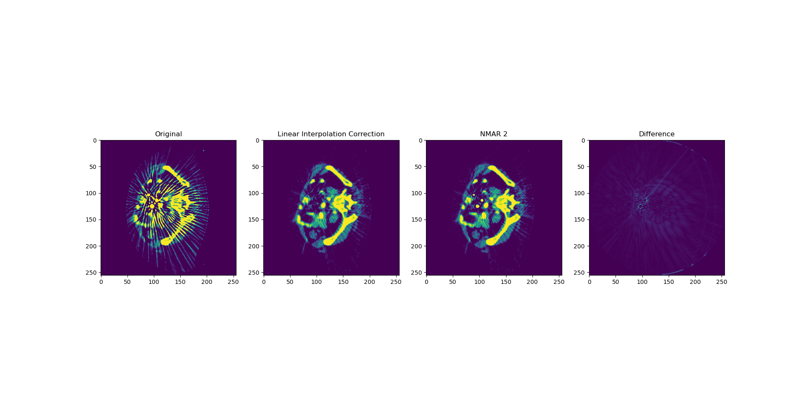

# NMAR
python implementation of  [normalized metal artifact reduction](https://pubmed.ncbi.nlm.nih.gov/21089784/)

the main code is modified from https://github.com/yanbozhang007/CNN-MAR

demo result

